<!--
===================================================================
  DYUTHI | GITHUB PROFILE README
===================================================================
-->
## 📌 About Me

I'm a second-year Computer Science student interested in building software and understanding how things work beneath the surface.

Currently focusing on problem-solving, software development, open source, and AI. I enjoy turning ideas into projects, participating in hackathons, and learning through building. I've contributed through GSoC, hackathons, and student tech communities, and I'm working on strengthening my foundations.

Still figuring out what I want to build. In the meantime, I'm building things.

  

---

## 💻 Tech Stack & Tools

### 🗣️ Languages

### 🧰 Tools, Frameworks & Libraries

### 🔍 Domains & Focus
`Data Structures & Algorithms` • `Software Development` • `Open Source` • `AI & RAG` • `AWS / Cloud` 

---

## 👥 Positions & Community

* **Developer Student Clubs (DSC)** — *Event Coordinator*  
  Organizing technical workshops, coding sessions, and campus hackathons.

* **Linux Campus Club** — *Technical Member*  
  Participating in open-source discussions, Linux environment setups, and technical talks.

* **GirlScript Summer of Code (GSSoC)** — *Contributor*  
  Contributing code and collaborating with project maintainers across open-source repositories.

---

## 🧩 LeetCode Stats

  <a href="https://leetcode.com/u/dyuthisimha/">
    <picture>
      <source media="(prefers-color-scheme: dark)" srcset="https://leetcode-stats-six.vercel.app/dyuthisimha?theme=dark" />
      <source media="(prefers-color-scheme: light)" srcset="https://leetcode-stats-six.vercel.app/dyuthisimha?theme=light" />
      
    </picture>
  </a>

---
## 📊 GitHub Stats

  <!-- Contribution Streak Stats Card -->
  <a href="https://github.com/dyuthisimha">
    <picture>
      <source media="(prefers-color-scheme: dark)" srcset="https://streak-stats.demolab.com?user=dyuthisimha&theme=dark&hide_border=true" />
      <source media="(prefers-color-scheme: light)" srcset="https://streak-stats.demolab.com?user=dyuthisimha&theme=default&hide_border=true" />
      
    </picture>
  </a>

---

## 📬 Let's Connect

 

  <i>Designed with curiosity. Continuously updated as I learn and build.</i>

